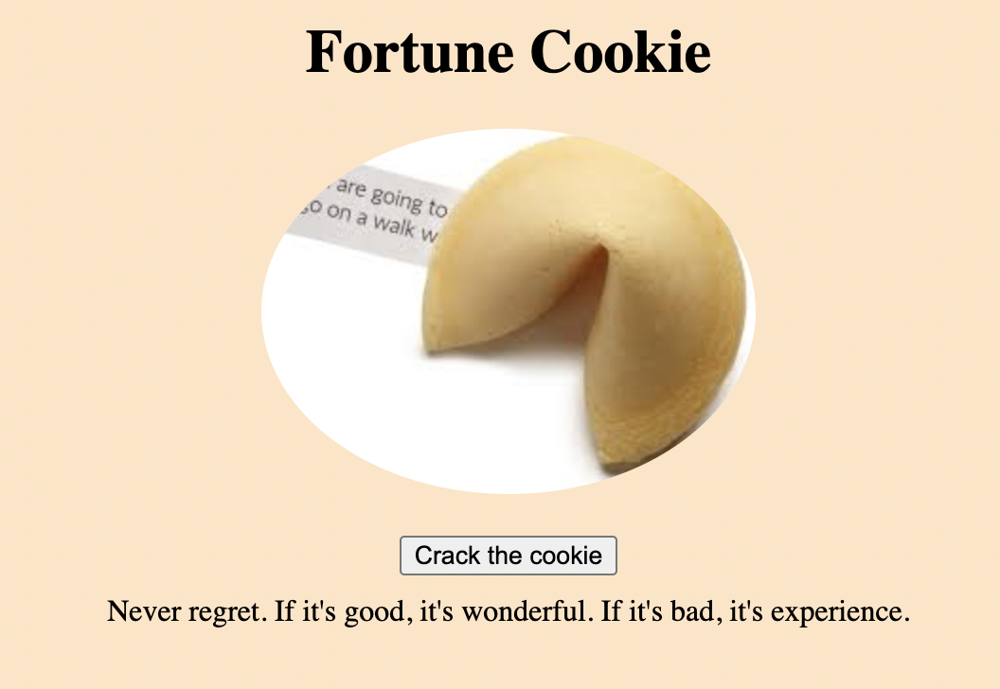

# Fortune Cookie web application
**Project name:** Fortune Cookies

Link: https://levyanh.github.io/

**API choice:** https://api.adviceslip.com/advice

**Project description:**
Fortune cookie is a fun mini game that users can play when they feel bored. Also users can learn more about fortune cookies' history and myth, how to make fortune cookie for Valentines day or where to buy yummy fortune cookie in San francisco.

**An embedded screenshot of the app**

**List of technologies used:**
- HTML
- CSS
- JavaScript
- Use Javascript for DOM manipulation
- Request data from an API and display that data on the main page

**User Stories:**
- As a fortune cookie lover (a user), I will be able to fill your keyword to the search bar, and click on the "crack the cookie" button to search for the advice.
- As a user, I will be able to search multiple times with different keywords.
- As a user, I will be able to see the change of cookie's image.
- As a user, I will be able to navigate to different website by clicking on the hyberlink.
- As a user, I will be able to see a map of Fortune cookie factory.

**Wireframes:**

**Something could be improve in the future:**
- Style CSS for mobile device
- Use Google map API
- Get more variable content.
